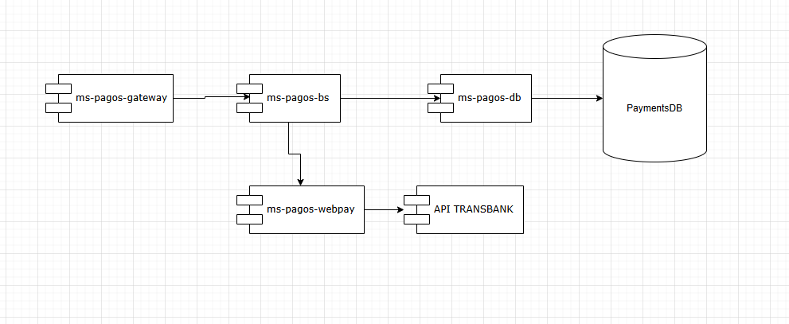

This is an API called api_pagos, which role in a ecommerce system is to integrate the Transbank API (Webpay), and communicate with other APIs in the system, like the api_ordenes, which will be working processing the customer orders, and api_pagos will receive certain information of the orderDTO itself, as the total price for example. Also, they will be working with asynchronous communication, as when the payment order is created there will be a state of pending, and when the payment is succesfull there will be an update of the state to succeded, or something like that.

Also, this API will have different microservices attached, as the one that receives the calls or make the calls to other APIs in the system, also one that manages the business logic (for example, managing payment states, processing payments, etc.), one that connects to the Transbank API for Webpay service and one that connects to a database that store information of the payments.

This API receives the information of the PaymentOrder from the OrdersAPI, and then process the information to communicate with the Transbank API. So, there is a microservice that receives calls from the outside as a gateway, then a microservice that manages or orchestrates the payments, then a microservice the connects to the database, so that it writes and reads the data, and one that connects to transbank, so it manages the credentials and receives all the information from the orchestrator, so it’s like an ambassador (it doesn’t implement the Transbank API with the SDK, but with HTTP calls).